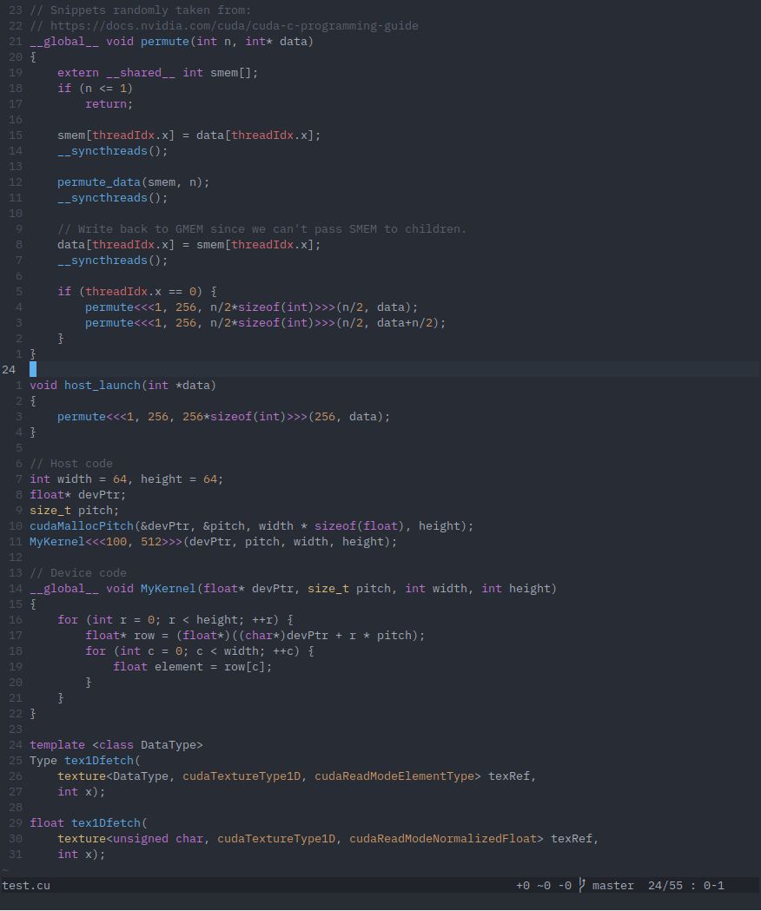

# vim-cuda-syntax

This file provides syntax highlighting for CUDA development in Vim. Compared to
Vim's default CUDA syntax file, it adds highlighting of all CUDA defined:
- types
- enums
- constants
- global variables
- functions
- namespaces
- thrust keywords

as well as highlighting of the triple-angle brackets in CUDA kernel calls.

All keywords were accumulated from the
[CUDA Toolkit Documentation](http://docs.nvidia.com/cuda/index.html).

#### Screenshot

<dl>
<p align="center">

</p>
</dl>

#### Limitations

1. Highlighting of the triple angle-brackets in CUDA kernel calls works only
   when the angle brackets are on the same line. The function name is only
   highlighted when called without template arguments, i.e. `mykernel` won't be
   highlighted in `mykernel<foo, bar><<<grid, threads>>>(data)`.

2. CUDA [data fields](https://docs.nvidia.com/cuda/cuda-runtime-api/functions.html#functions)
   are not highlighted because many keywords have familiar names which could
   collide with either user-defined variables (like `ptr`, `x`, `y`), or with
   C++ standard library types (like `function` or `array`) and would mess up the
   highlighting.


## Optional features

```vim
" Highlight keywords from CUDA Runtime API
let g:cuda_runtime_api_highlight = 1

" Highlight keywords from CUDA Driver API
let g:cuda_driver_api_highlight = 1

" Highlight keywords from CUDA Thrust library
let g:cuda_thrust_highlight = 1

" Disable highlighting of CUDA kernel calls
let g:cuda_no_kernel_highlight = 1
```


## Installation

Since this syntax file fully replaces Vim's default CUDA syntax file, copy the
`cuda.vim` file into the `~/.vim/syntax` directory.


## FAQ

> I want everything in-between the triple angle-brackets highlighted to get a
> more distinct highlighting of kernel calls.

Add the following lines to `~/.vim/after/syntax/cuda.vim` (create the file if
it doesn't exist):
```vim
syntax match cudaKernelAngles "<<<\_.\{-}>>>"
highlight link cudaKernelAngles Operator
```

> I want the CUDA language extensions (`__device__`, `__host__`, etc.)
> highlighted like the standard C/C++ keywords.

Add the following to `~/.vim/after/syntax/cuda.vim`:
```vim
highlight link cudaStorageClass Statement
```


## License

Distributed under the same terms as Vim itself. See `:help license`.
